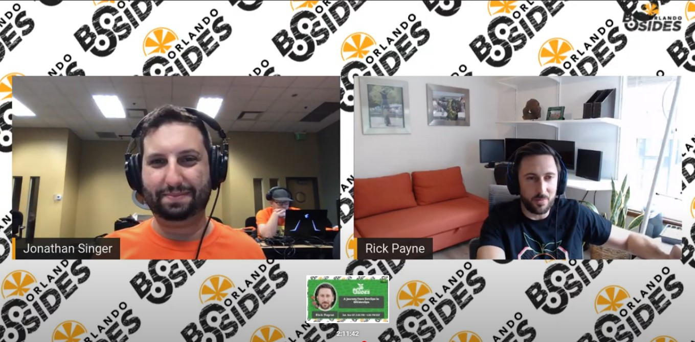
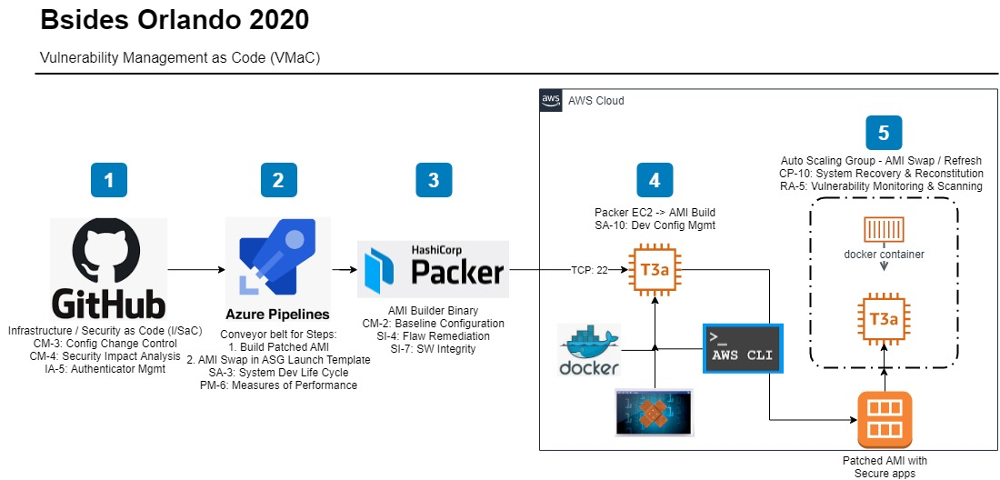

# Table of Contents
- [Table of Contents](#table-of-contents)
- [Bsides 2020 Event Notes](#bsides-2020-event-notes)
  - [Pre-Requisites](#pre-requisites)
    - [Visual Studio Code](#visual-studio-code)
    - [Packer](#packer)
      - [Useful commands](#useful-commands)
    - [Docker Desktop](#docker-desktop)
      - [Useful commands](#useful-commands-1)
    - [AWS CLI v2](#aws-cli-v2)
      - [Useful commands](#useful-commands-2)
    - [Putty](#putty)
  - [Tooling](#tooling)
    - [Azure DevOps - Sign in & Create First Project](#azure-devops---sign-in--create-first-project)
    - [Azure DevOps - First Pipeline](#azure-devops---first-pipeline)
    - [Azure DevOps - Secrets (IA-1)](#azure-devops---secrets-ia-1)
    - [AWS - Create Auto Scaling Group (CP-10)](#aws---create-auto-scaling-group-cp-10)
    - [AWS - Create Launch Tempalte](#aws---create-launch-tempalte)
    - [AWS - ASG Instance Refresh](#aws---asg-instance-refresh)
    - [AWS - ASG User Data](#aws---asg-user-data)
    - [GitHub - Branch Protection](#github---branch-protection)
    - [Packer - AWS .json](#packer---aws-json)
 
<a name="notes"></a>
# Bsides 2020 Event Notes
Presentation (1h52m start) - https://www.youtube.com/watch?v=H5R7MpAjdv8


Event Page - https://2020.bsidesorlando.org/

Speaker Profile - https://2020.bsidesorlando.org/#/speakers?lang=en&speakerId=17525000000482016

Session - A journey from DevOps to SECdevOps - Track 2 - Nov 07, 2020 - 03:30 PM - 04:30 PM (EST)

About speaker / talk summary  
Rick Payne has spent the last 15 years climbing the tech ladder from an Intern to a DevOps technician -> Security Analyst -> Architect -> CSO -> arriving in Silicon Valley, on promotion 10, as a cloud focused Staff Information Security Engineer. His foundation is standards-based and rooted in DevOps automation and Systems Security Engineering (SSE). This climb was facilitated through continuous educational activities including several college degrees(AA, AS, BS, MSc), professional certifications(CISSP, RHCE, RHCSA, AWS-CSA, Sec+), attending various conferences(Bsides, SANS) and workshops, and teaching cybersecurity at local schools(CyberPatriot) and colleges(CyberCamp). He’s building his masterpiece, the Secure Image & Container (SIC) Factory, and is excited to share this journey. The SIC Factory is a global, multi-cloud, heterogeneous, CICD Infrastructure / Security as Code solution. This broad discussion will cover everything from DevSecOps, Vulnerability Management, Maturity Models, Security Frameworks, to Cultural impacts.

Behind the scenes photo  


This page contains my raw notes used to build the demo. 

Labor Estimates to Date (Blocks includes family activities e.g. bike rides, meal routines, wresting, chore debates, brother fight mediation sessions... ):
- 11/6: 5pm - 1am
- 11/7: 7am - 3pm
- 11/11: 9am - 3pm
- Total ~22h


Demo Workflow


## Pre-Requisites
The toolset below was used to prepare and build the demo.

### Visual Studio Code
1. https://code.visualstudio.com/download
2. Install
3. Open Folder > Navigate to your GitHub folder
4. Download and install Git as needed selecting VS Code as Git's default editor

### Packer
1. Download windows packer https://www.packer.io/downloads
2. Extract to C:\WINDOWS\system32
3. Leverage template from https://learn.hashicorp.com/tutorials/packer/getting-started-build-image
  3. AWS > EC2 > Launch > Grab latest U18 AMI ID
4. Use CLI describe-images to locate the source name e.g. ubuntu/images/hvm-ssd/ubuntu-bionic-18.04-amd64-server-<date>
5. Update the .json source_ami_filter.filters.name
6. Replace the date with -* on the end to ensure the latest image is used
7. Instance_type: t4g.nano 

#### Useful commands
```shell
$ packer validate aws-u18-dockvpn.json
$ packer build -var 'aws_access_key=$(aws_access)' -var 'aws_secret_key=$(aws_secret)' -var 'azdo_build=$(Build.BuildNumber)' aws-u18-dockvpn.json
$ aws ec2 describe-images --image-ids ami-0ea142bd244023692
```

### Docker Desktop
1. https://hub.docker.com/editions/community/docker-ce-desktop-windows
2. Download and install
3. Reboot
4. Requires Kernel update - https://docs.microsoft.com/en-us/windows/wsl/wsl2-kernel
5. Reboot


#### Useful commands
```shell
$ docker run --name bsides -v /home/ubuntu/index.html:/usr/share/nginx/html/index.html:rw -p 80:80 -d nginx
$ docker run --name bsides -v /home/ubuntu/nginx:/usr/share/nginx/html:rw -p 80:80 -d nginx
$ docker images
$ docker ps
$ docker top
$ docker image build --tag rickpayne929/vmac .
$ docker container ls
$ docker container stop 7d21b13c3175
$ docker container rm 7d21b13c3175
```

### AWS CLI v2
1. https://docs.aws.amazon.com/cli/latest/userguide/install-cliv2-windows.html 

#### Useful commands
```shell
$ aws configure

or
    export AWS_ACCESS_KEY_ID=$(aws_access)
    export AWS_SECRET_ACCESS_KEY=$(aws_secret)
    export AWS_DEFAULT_REGION=us-east-1

$ aws sts get-caller-identify
$ aws ec2 describe-images --image-ids ami-0ea142bd244023692

$ aws ec2 create-launch-template-version --launch-template-id lt-08e35b16cb28fb4e7 --version-description $(Build.BuildNumber) --source-version 11 --launch-template-data '{"ImageId":"'$NewAMI'"}'
    
$ aws autoscaling start-instance-refresh --cli-input-json file://instance-refresh.json
```

### Putty
1. https://www.chiark.greenend.org.uk/~sgtatham/putty/latest.html 


## Tooling


### Azure DevOps - Sign in & Create First Project
1. https://azure.microsoft.com/en-us/pricing/details/devops/azure-devops-services/
2. Create or Sign in with your MS account
3. Choose your country/region
4. Project name: Vuln Mgmt as Code
5. Visibility: Private
6. Create project 


### Azure DevOps - First Pipeline
1. Where is your code? GitHub
2. Sign in to GitHub
3. Authorize AzurePipeline
4.	Select your repo
5.	Approve and install Azure Pipelines
6.	Configure your pipeline: Starter pipeline

### Azure DevOps - Secrets (IA-1)
1. Edit Pipeline > Variables > New Variable
   - Name: aws_access, aws_secret
   - Value: aws access, aws secret
   - Check: Keep this value secret
   - Yml var reference $(aws_access), $(aws_secret)
   - Ok
2. Save 


### AWS - Create Auto Scaling Group (CP-10)
1. AWS > EC2 > Auto Scaling Groups > Create Auto Scaling group
   - Name: Aws-u18-dockvpn
   - Select Launch template from above
   - Next
   - Subnets: select us-east-1a, us-east-1b
   - Next
   - Enable load balancing? Later
   - Health check: 300s (default)
   - Next
   - Desired capacity: 1
   - Minimum capacity: 1
   - Maximum capacity: 2
   - Scaling policies: Target tracking scaling policy
     - Metric type: avg cpu
     - Target value: 50
    - Instances need: 300s
   - Next
   - Add notifications > Next
   - Add tags: Name, aws-u18-dockvpn
   - Next
   - Create Auto Scaling group
2. Edit aws-u18-dockvpn Launch template
   - Version: Latest
   - Update


### AWS - Create Launch Tempalte
1. Run Pipeline
2. AWS > EC2
3. Right Click “Packer Builder” instance >  
   - Name: aws-u18-dockvpn
   - Version desc: v1 from Packer launch
   - Check: Provide guidance to help me
   - Template tags
   - Name, aws-u18-dockvpn
   - Key pair name: something you have!
   - Networking platform: VPC
   - Security groups: First EC2
   - Resource tags: Name, aws-u18-dockvpn 
   - Resource types: Check Instances, Volumes
   - Remove: network interfaces, Shutdown & stop behavior
   - User data: docker pull nginx
   - Create Template


### AWS - ASG Instance Refresh
1. https://aws.amazon.com/blogs/compute/introducing-instance-refresh-for-ec2-auto-scaling/
   - aws autoscaling start-instance-refresh --auto-scaling-group-name aws-u18-dockvpn --preferences '{"InstanceWarmup": 300, "MinHealthyPercentage": 49}'
2. https://awscli.amazonaws.com/v2/documentation/api/latest/reference/autoscaling/start-instance-refresh.html
   -	aws autoscaling start-instance-refresh --cli-input-json file://instance-refresh.json
3.	https://awscli.amazonaws.com/v2/documentation/api/latest/reference/ec2/create-launch-template-version.html?highlight=create%20launch%20template
   - aws ec2 create-launch-template-version --launch-template-id lt-0abcd290751193123 --version-description $(Build.BuildNumber) --source-version 3 --launch-template-data '{"ImageId":"ami-06216993c7d486e87"}'

### AWS - ASG User Data
This pulls an nginx container and leverages host files using the -v mount option
```shell
#!/bin/bash
docker run --name bsides -v /home/ubuntu/nginx:/usr/share/nginx/html:rw -p 80:80 -d nginx
```

### GitHub - Branch Protection
1. https://github.com/rickpayne929/presentations/settings > Branches
2. Branch protection rule
3. Branch name pattern: master
4. Require status checks to pass before merging


### Packer - AWS .json
1. Download windows packer https://www.packer.io/downloads 
   - get-childitem $env:
   - Extract to C:\WINDOWS\system32
   - Test  
   - Add an exclusion was 1 click! 1 click exclusions
2. Copy template from https://learn.hashicorp.com/tutorials/packer/getting-started-build-image
   - Grab latest U20 AMI id: ami-0ea142bd244023692
   - aws ec2 describe-images --image-ids ami-0ea142bd244023692
   - update source_ami_filter.filters.name
   - Replace the date with -* on the end to ensure the latest is pulled
     - The wildcard filter grabbed this AMI ubuntu/images/hvm-ssd/ubuntu-focal-20.04-arm64-server-20201026
   - Instance_type: t4g.nano is 0.0042 USD per Hour
3. packer validate example.json
4. packer build \
   - -var 'aws_access_key=YOUR ACCESS KEY' \
   - -var 'aws_secret_key=YOUR SECRET KEY' \
     - example.json
     - 945: Started
     - 946: Waiting for AMI
     - 947: Complete
     - Build 'amazon-ebs' finished after 1 minute 53 seconds.