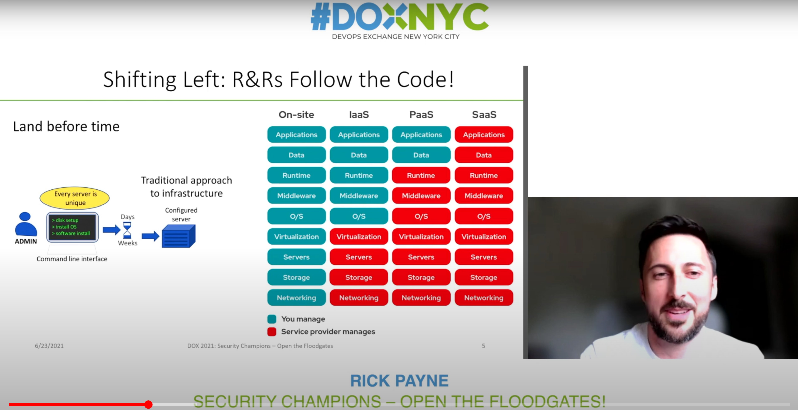
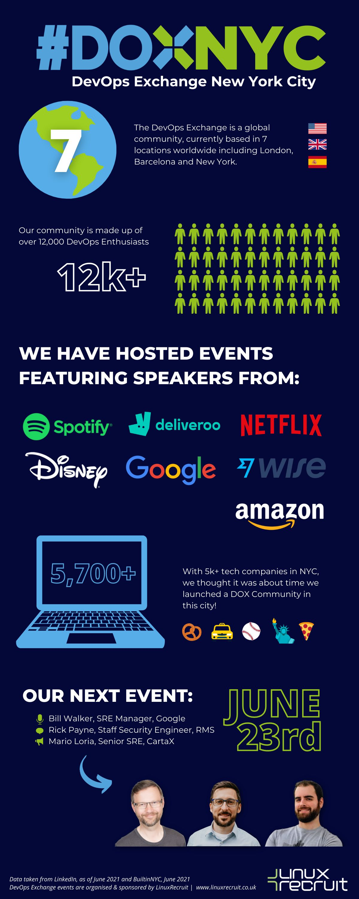

# Table of Contents
- [Table of Contents](#table-of-contents)
- [DevOps Exchange Event Notes](#devops-exchange-event-notes)
- [Promo](#promo)
  - [Flyer 1](#flyer-1)
  - [Flyer 2](#flyer-2)
  - [InfoGraphic](#infographic)
# DevOps Exchange Event Notes 

Presentation - https://www.youtube.com/watch?v=SWiFtKaVghI

Event Page - https://www.meetup.com/DOXNYC/events/278299834/

Blog - https://www.linuxrecruit.co.uk/blog?title=DOXNYC%20Special%20ft.%20Google,%20RMS%20%26%20CartaX&id=169

Session - "Security Champions – Open the Floodgates!" - June 23, 2021 530PM ET

About speaker / talk summary
Synopsis: Are you DevOps’ing all the things? Culture? Yep. Cool toolchain? Sure! Shipping your code and product with quickness? You know it! The industry concern; however, is you may be delivering more vulnerabilities than features! Perhaps some plain-text secrets committed in code? Maybe some critical vulnerabilities in outdated AMIs? And surely an excessively permissive Administrator IAM role to make a few simple API calls!? If you’re nodding and/or shaking your head to any of these, focusing resources on reducing your deployment frequency is also reducing your time-to-compromise.

This talk is to raise awareness of security-focused improvements that you can make today. We’ll discuss ways to get the security monkey off your back by mapping your strengths to compliance controls such as Blue/Green deploys to Disaster Recovery, security responsibilities you didn’t know you had, a live demo!?...and a 4 tier DevOps security maturity model: DevOps -> DevOpsSec -> DevSecOps -> SecDevOps.

Rick Payne is a Principal Information Security Engineer at RMS. He’s been to the bottom of the security ocean achieving 10+ federal security authorizations, around the world on his global, multi-cloud, heterogeneous imaging and patching services, and stays in the community through advisory boards, CyberCamps, and security conferences. Since earning his MSc in 2020, he’s all in on sharing DevSecOps with anyone who has ears!

# Promo

## Flyer 1

## Flyer 2

## InfoGraphic
