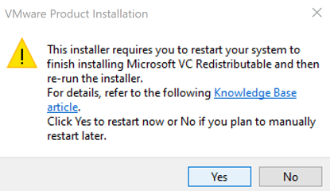
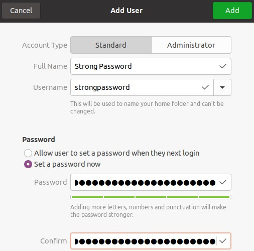

# Table of Contents

- [Table of Contents](#table-of-contents)
- [Sixth Grade Science Experiment - Overview](#sixth-grade-science-experiment---overview)
- [Week 1 - Virtual machine install](#week-1---virtual-machine-install)
  - [Week 1 Q&A](#week-1-qa)
  - [1. Confirm Virtualization Technology is Enabled](#1-confirm-virtualization-technology-is-enabled)
  - [2. Download Ubuntu 20.04.3 LTS .iso](#2-download-ubuntu-20043-lts-iso)
  - [3. Install VMware Player](#3-install-vmware-player)
  - [4. Install Ubuntu 20.04.3 in VMware Workstation Player](#4-install-ubuntu-20043-in-vmware-workstation-player)
  - [5. Configure Resolution](#5-configure-resolution)
  - [6. Power Off the machine](#6-power-off-the-machine)
  - [Week 1 Comments](#week-1-comments)
- [Week 2 - Create User Accounts, Install John the Ripper, Crack Passwords](#week-2---create-user-accounts-install-john-the-ripper-crack-passwords)
  - [Power On the Virtual Machine and Logon](#power-on-the-virtual-machine-and-logon)
  - [Create User Accounts](#create-user-accounts)
  - [Install John the Ripper (JrR) and Benchmark Machine](#install-john-the-ripper-jrr-and-benchmark-machine)
  - [Combine System Password Files](#combine-system-password-files)
  - [Crack Passwords](#crack-passwords)
- [Labor Estimates to Date (Blocks includes family activities e.g. bike rides, meal routines, wrestling, chore debates, brother fight mediation sessions... :)](#labor-estimates-to-date-blocks-includes-family-activities-eg-bike-rides-meal-routines-wrestling-chore-debates-brother-fight-mediation-sessions-)
- [References](#references)
  - [Admin Magazine - https://www.admin-magazine.com/Articles/John-the-Ripper](#admin-magazine---httpswwwadmin-magazinecomarticlesjohn-the-ripper)
  - [Openwall - https://www.openwall.com/john/doc/EXAMPLES.shtml](#openwall---httpswwwopenwallcomjohndocexamplesshtml)
  - [Openwall - https://www.openwall.com/john/doc/MODES.shtml](#openwall---httpswwwopenwallcomjohndocmodesshtml)
  - [Openwall GitHub - https://github.com/openwall/john](#openwall-github---httpsgithubcomopenwalljohn)
  - [Daniel Miessler Password Lists - https://github.com/danielmiessler/SecLists/tree/master/Passwords](#daniel-miessler-password-lists---httpsgithubcomdanielmiesslersecliststreemasterpasswords)

# Sixth Grade Science Experiment - Overview
My mission is to help prepare our youth for a successful career in technology. Most perceive what we're going to accomplish here as wizardry or approach tech with a fixed mindset "I can't do that". The intent here is to break the barrier by demonstrating a 6th grader can complete this experiment.

The experiment will test weak, medium and strong password strength with a password cracking tool(app). The objective is to measure Time to Crack (TtC) for all 3. 

Here's my kitchen table draft explaining to my son for the first time:

# Week 1 - Virtual machine install
 - [x] GitHub Issue [#7](https://github.com/rickpayne929/presentations/issues/7)

## Week 1 Q&A
Q: What are the minimum hardware requirements for this course?
A: Dual core processor, 4 GB RAM, 25 GB HDD

Q: What are the software requirements for this course?
A: This guide will be written for Windows 10 and VMware Player; however, Linux and Mac can also run virtual machines using VMware and other desktop hypervisor applications. 

## 1. Confirm Virtualization Technology is Enabled
1. Open Task Manager 
    - Keyboard shortcut: (ctrl + shift + esc)
    - Window Key > Type task > Task Manager
    - Right Click the Taskbar > Task Manager
    - (ctrl + alt + del) > Task Manager
2. Check Task Manager Performance tab for Virtualization Status
    - Select: Performance Tab
    - Review the CPU data in the bottom right. Specifically, Virtualization should be Enabled 
    - If Enabled, proceed to the next section to start the Ubuntu download
    - If Disabled, research “how to enable virtualization technology for your machine” e.g. Google: “how to enable virtualization technology for Lenovo or Dell or …”
3. If Disabled, Go to BIOS to Enable Virtualization
    - The steps should resemble:
      - Reboot
      - Press Del or F2 or ? to enter BIOS
      - Navigate to the Security  or Advanced Tab
      - Set Virtualization Technology and VT-d to Enabled
      - Save (F10) and Exit
      - Example for Lenovo: https://support.lenovo.com/in/en/solutions/ht500006-how-to-enable-virtualization-technology-on-lenovo-computers 
      - Example for MSI: https://www.msi.com/faq/nb-1627 

## 2. Download Ubuntu 20.04.3 LTS .iso
1. https://ubuntu.com/download/desktop
2. Click: Download 
    - The file is 2.9GB. It’ll take around 50 minutes to download at 9Mbps using the default link. I was impatient and went to Princeton’s 20Gbps download here: https://mirror.math.princeton.edu/pub/ubuntu-iso/focal/ This took about 7 minutes hopping between 30 - 60Mbps

## 3. Install VMware Player
Note: This will require a restart
1. Download VMware Workstation Player
    - https://www.vmware.com/products/workstation-player.html
    - Click: DOWNLOAD FOR FREE 
    - Click: GO TO DOWNLOADS
    - For “VMware Workstation 16.1.2 Player for Windows 64-bit Operating Systems”, Click DOWNLOAD NOW
2. Install VMware Workstation Player
    - Start the installer by double clicking the downloaded file. It’s currently version VMware-player-16.1.2-17966106.exe on 10/9/2021
      - Select Yes if you receive a User Account Control (UAC) popup
      - Select Yes if you receive a popup to restart 
      - Log back in and continue the installation by double clicking the installer again
      - Select the Default options. They should be:
        - Next
        - Accept the terms > Next
        - If you receive a “Compatible Setup” screen, Check “Install Windows Hypervisor Platform (WHP)” > Next 
        - At Custom Setup, Check “Enhanced Keyboard…” > Next 
        - At User Experience Settings, Uncheck “Join the VMware…” > Next
        - At Shortcuts, Next
        - Install
        - Finish > Yes to restart

## 4. Install Ubuntu 20.04.3 in VMware Workstation Player
1. Open VMware Workstation Player
   - Windows Key > VMware > Press Enter when VMware Workstation is highlighted 
   - Select “Use VMware…” > Continue
   - Finish
     - You should be here 
2. Create the Ubuntu Virtual Machine
   - Click: Create a New Virtual Machine 
   - Click Browse… and navigate to the ubuntu-20.04.3-desktop-amd64.iso file. The default download location will be in This PC > Downloads 
   - Next
   - At Easy Install Information \ Personalize Linux, Try something like:
     - Full name: Your first and last name
     - User name: First initial+last name e.g. rpayne
     - Password: something secure and memorable e.g. “Ubuntu 20.04.3 password cracking setup.” or rpayne :)
     - Next
   - At Name the Virtual Machine, “Ubuntu 64-bit for Password Testing”
   - Next
   - At Specify Disk Capacity, 25.0GB per Ubuntu’s recommendation. This is fine since it’s temporary. Increase as you’d like if you’re going to keep the machine around.
   - Next
   - At Ready to Create Virtual machine, Click: Customize Hardware…
     - Memory: 2GB Minimum or increase to 8GB if available (check Task Manager > Performance Tab > Memory)
     - Processors: 2 or all (check Task Manager > Performance Tab > CPU > Logical processors)
     - Close
   - Finish
     - The Virtual Machine should be powering on similar to this 
   - Check: Do not show > OK
   - Download and Install > Yes 
   - The installation will begin automatically 
     - It should take 20-30minutes to complete depending on computer performance 

## 5. Configure Resolution
1. Clear the "Online Accounts" screen
   - Log in
   - At the Online Accounts screen
     - Click Skip
     - Next
     - Next
     - Next
     - Done
2. Use "Displays" to Configure Resolution
   - In the bottom left, Click: Show Applications 
   - Type and then select Displays
   - Set the Resolution to the an optimal size > Apply 
   - Click the X to close

## 6. Power Off the machine
1. At the top right of the screen, Click the Power drop down > Power Off / Log Out > Power Off… > Power Off 

## Week 1 Comments

Like opening the Task Manager, there are many routes to create the opportunity to safely test in a Linux environment. We could have:

1.	Launched an Ubuntu EC2 instance in Amazon Web Services (AWS)
2.	Started a Docker container
3.	Used Windows Subsystem for Linux (WSL)

I see the local virtualization path as foundational. It offers the beginning learner an easier user experience with a GUI. 

# Week 2 - Create User Accounts, Install John the Ripper, Crack Passwords

## Power On the Virtual Machine and Logon
1. Open VMware Workstation Player
   - Windows Key > VMware > Press Enter when VMware Workstation is highlighted 
     - You should be here 
2. Start the Ubuntu Virtual Machine
   - Under Home, Select your Virtual Machine created in Week 1, Section 4
   - Click either Green Play button to Power On [VMware Start VM](images/vmware_start.png)
   - If you receive a “Cannot connect” prompt, Click No  [VMware Device No](images/vmware_device_no.png)
   - You should be here 
3. Logon
   - Send keyboard and mouse input to the virtual machine by clicking anywhere on the Ubuntu login screen (purple background)
   - Click your user name > Enter password created in Week 1, Section 4

## Create User Accounts
1. Open User Settings
   - Window Key > Users > Press Enter when Users appears 
2. Create a User - "Strong Password"
   - In the top right, Click: Unlock... > Enter password created in Week 1, Section 4
   - In the top right, Click: Add User... 
     - Account Type: Standard
     - Full Name: Strong Password
     - Username: strongpassword
     - Select: Set a password now
     - Password: This_is_a_really_str0ng_p@$$w0rd!!! 
     - Click: Add > Enter password created in Week 1, Section 4
3. Create a User - "Medium Password"
   - In the top right, Click: Add User... 
     - Account Type: Standard
     - Full Name: Medium Password
     - Username: strongpassword
     - Select: Set a password now
     - Password: P@$$w0rd! 
     - Click: Add > Enter password created in Week 1, Section 4
4. Close User Settings by clicking the orange X 
5. Open a Terminal
   - Window Key > Terminal > Press Enter when Terminal appears 
6. Create a User - "Medium Password"
   - In the terminal, type: sudo adduser weakpassword > Press: Enter > Enter password created in Week 1, Section 4 
     - Password: password
     - Full Name: Medium Password
     - Room Number: 1
     - Work Phone: 1
     - Home Phone: 1
     - Other: 1
     - Is the information correct: type: y > Press Enter 

## Install John the Ripper (JrR) and Benchmark Machine
1. Intall JtR
   - In the terminal, type: sudo snap install john-the-ripper > Press: Enter > Enter password created in Week 1, Section 4 
   - In the terminal, type: sudo apt install john -y > Press: Enter > Enter password created in Week 1, Section 4 
   - In the terminal, type: echo "alias john-multi=/snap/bin/john" > ~/.bashrc > Press: Enter 
   - In the terminal, type: cat ~/.bashrc > Press: Enter 
   - In the terminal, type: source ~/.bashrc > Press: Enter 
   - 
2. Benchmark Machine - Single CPU
   - In the terminal, type: john --test > Press: Enter 
   - You can note the descrypt number (4748k) in "Many salts: 4748k c/s" 
3. Benchmark Machine - All CPUs
   - In the terminal, type: john-multi --test > Press: Enter
   - Press Ctrl + C once to quit at any time 
   - You can note the descrypt number (4748k) in "Many salts: 4748k c/s" 

## Combine System Password Files
1. Combine Password Files
   - In the terminal, type: sudo unshadow /etc/passwd /etc/shadow > system_passwords.txt > Press: Enter > Enter password created in Week 1, Section 4
2. Format Password Hash File
   - In the terminal, type: sed 's/:100.*//' system_passwords.txt | grep password > filtered_passwords.txt > Press: Enter 
3. Confirm Password File Unshadow
   - In the terminal, type: ll filtered_passwords.txt > Press: Enter 
   - In the terminal, type: tail -n 3 filtered_passwords.txt > Press: Enter 
   - 

## Crack Passwords
1. Download Wordlists
   - In the terminal, type: wget https://raw.githubusercontent.com/danielmiessler/SecLists/master/Passwords/darkweb2017-top10000.txt > Press: Enter 
   - 
2. Dictionary Attack
   - In the terminal, type: john-multi --wordlist:darkweb2017-top10000.txt filtered_passwords.txt > Press: Enter 
   - View status by pressing Space bar
   - Cracked passwords will be displayed in the prompt
   - Press Ctrl + C to quit at any time
   - 
3. View Cracked Passwords
   - In the terminal, type: john-multi --show filtered_passwords.txt > Press: Enter 
   - 
4. Single Crack Mode
   - In the terminal, type: john-multi --single filtered_passwords.txt  > Press: Enter 
4. View Cracked Passwords
   - In the terminal, type: john-multi --show filtered_passwords.txt > Press: Enter 
   - 
5. Dictionary Attack with Word Mangling, View Cracked Passwords
   - john-multi --wordlist:darkweb2017-top10000.txt --rules filtered_passwords.txt > Press: Enter
   - 
6. Incremental Attack
   - Note: this attack will run indefinitely 
   - In the terminal, type: john-multi --incremental filtered_passwords.txt > Press: Enter
   - View status by pressing Space bar
   - Cracked passwords will be displayed in the prompt
   - Press Ctrl + C once to quit at any time
   - 
7. Restore Exited Session
   - In the terminal, type: john-multi --restore > Press: Enter
   - 
8. View Cracked Passwords 
   - In the terminal, type: john-multi --show filtered_passwords.txt > Press: Enter 
   - 

# Labor Estimates to Date (Blocks includes family activities e.g. bike rides, meal routines, wrestling, chore debates, brother fight mediation sessions... :)
- 10/9: ~3h to draft VM Install Steps
- 10/16: 11am - 2pm to Prepare Installation for Peer Review in this README.md
- 10/30: 11am - 5pm to Oversee student completing Week 1 and drafting Week 2 instructions
- 10/31: 8am - 2pm for Week 2 Password cracking iterations

# References
## Admin Magazine - https://www.admin-magazine.com/Articles/John-the-Ripper
## Openwall - https://www.openwall.com/john/doc/EXAMPLES.shtml 
## Openwall - https://www.openwall.com/john/doc/MODES.shtml
## Openwall GitHub - https://github.com/openwall/john
## Daniel Miessler Password Lists - https://github.com/danielmiessler/SecLists/tree/master/Passwords